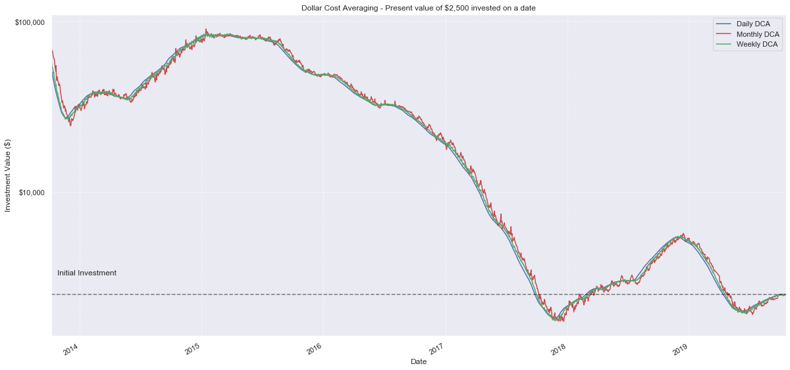

## Disclaimer

As usual, bear in mind that **past performance is not indicative of future results**. This article is about evaluating and understanding performance of strategies from an arbitrary point of time in the past until today. Basing your financial decisions solely on this source would be, at best, irresponsible. If you are just looking to get rich quick, buying lottery tickets may be more effective and yield more predictive result than trying to understand Bitcoin.

## TL;DR
We created an experiment demonstrating that monthly DCA yields statistically better results compared to both weekly and daily strategy. At its best, with an initial investment of $2,500, we will have $248.60 more on average compared to weekly investments, or $380.34 more compared to daily investments. 

## Definition of our problem

This article is inspired by a question on [r/Bitcoin](https://www.reddit.com/r/Bitcoin/comments/dnvfhk/best_way_to_dollar_cost_averaging_monthly_or/) and its 
aim is to evaluate if choosing a smaller period for investing portions of our lump sum while doing Dollar Cost Averaging, has any effect on our returns.

We chose 3 strategies to compare:

1. We divide our funds into 4 equal portions and invest monthly (every 30 calendar days)
2. We divide our funds into 16 equal portions and invest weekly (every 7 calendar days)
3. We divide our funds into 120 equal portions and invest daily

## Assumptions

- We have $2,500 to invest
- We already decided, that we want to Dollar Cost Average. See our article on [comparing Bitcion investment strategies](https://shitcoin.ninja/post/2019/10/comparing-bitcoin-investment-strategies/) for more information on this subject.
- We do not take price of money, opportunity costs or inflation into account. (This would marginally investments with less portions / longer periods)
- Our investment value is based on the closing price of any given period.
- We do not take any commissions or transaction related fees into account. (This would marginally investments with less portions / longer periods) 

## Importing financial data using Pandas

First, we have to initialize our workspace and find a suitable dataset to base our study on. 

- Data from 2013-10-06 onwards is taken from Kraken BTCUSD exchange pair, downloaded from http://www.cryptodatadownload.com/data/northamerican/

We will be importing the data using Pandas, a great python library providing high-performance, easy-to-use data structures and data analysis tools for the Python programming language. We will use it together with matplotlib, a python 2D plotting library that is Matlab flavored. Supporting calculations will be done by Numpy, fundamental package for scientific computing with Python.


```python
import pandas as pd
import matplotlib.pyplot as plt
import numpy as np
from matplotlib.ticker import FuncFormatter
from matplotlib import style
import seaborn as sns

sns.set()
sns.set_style('dark')
sns.set_palette(sns.color_palette('muted'))
fig = plt.figure()
fig.patch.set_alpha(0.0)


# Basic styling
# style.use('seaborn-notebook')
pd.set_option('display.width', 200)

# load data
btc = pd.read_csv("../data/source/Kraken_BTCUSD_d.csv", skiprows=1, usecols=['Date', 'Close'])
# Index dataset by date
btc['Date'] = pd.to_datetime(btc['Date'])
btc = btc.set_index('Date')
btc = btc.sort_index()

# ATTENTION - this is used so regenerating the data does not update notebook automatically
# Until I find a good way to inline numbers in markdown sections, this is the only solution
# I can think of to guarantee some consistency between generated outputs and written text
btc=btc.loc[:'2019-10-17']

# print results
print(btc.tail())
```

                 Close
    Date              
    2019-10-13  8280.0
    2019-10-14  8354.6
    2019-10-15  8164.5
    2019-10-16  8000.0
    2019-10-17  8030.3
    


    <Figure size 432x288 with 0 Axes>


## Calculating value of Dollar Cost Averaged investment

For our strategy, we will look into splitting our investment of $2,500 into 4, 16 or 120 equal portions, and we invest these during 4 consecutive months, 16 consecutive weeks or 120 consecutive days. A special case is investing within the last year, when there isn't time to DCA all of it. As a compromise, We invest what portions we can and keep the rest as cash, since that is how reality works.

Please note, that there are many more strategies and possibilities to do DCA, but we will stick to this one (for now).


```python
value_price = btc['Close'][-1]
initial_investment = 2500.00

def doDCAmonthly(investment, start_date, periods, freq):
    investment_dates_all = pd.date_range(start_date,periods=periods,freq=freq)
    # Remove those dates beyond our known data range
    investment_dates = investment_dates_all[investment_dates_all < btc.index[-1]]

    # Get closest business dates with available data
    closest_investment_dates = btc.index.searchsorted(investment_dates)

    # How much to invest on each date
    portion = investment/periods 

    # Get the total of all stocks purchased for each of those dates (on the Close)
    stocks_invested = sum(portion / btc['Close'][closest_investment_dates])

    # Add uninvested amount back
    uninvested_dollars = portion * sum(investment_dates_all >= btc.index[-1])

    # value of stocks today
    total_value = value_price*stocks_invested + uninvested_dollars
    return total_value

# Generate DCA series for every possible date and investment strategy
dca_m = pd.Series(btc.index.map(lambda x: doDCAmonthly(initial_investment, x, 4, '30D')), index=btc.index, name='Monthly DCA')

dca_w = pd.Series(btc.index.map(lambda x: doDCAmonthly(initial_investment, x, 16, '7D')), index=btc.index, name='Weekly DCA')

dca_d = pd.Series(btc.index.map(lambda x: doDCAmonthly(initial_investment, x, 120, '1D')), index=btc.index, name='Daily DCA')
```

We now have 3 series with possible gains for all 3 chosen strategies.  In order to better represent them, we can join them together and plot a figure with our gains.


```python
dca = pd.concat([dca_d, dca_m, dca_w], axis=1)

ax = plt.subplot()
dca[1:].plot(ax=ax, figsize=(20,10), color=['b','r','g'], label="DCA")

ax.set_yscale('log')
plt.grid(linestyle='dotted')
ax.yaxis.set_major_formatter(FuncFormatter(lambda x, pos: '${:,.0f}'.format(x)))

ax.axhline(initial_investment, alpha=0.5, linestyle="--", color="black")
ax.text(btc.index[20],initial_investment*1.3, "Initial Investment")
plt.title('Dollar Cost Averaging - Present value of $2,500 invested on a date')
plt.ylabel('Investment Value ($)')
plt.show()
```





It looks like all 3 lines are pretty much the same, with monthly strategy being more volatile than weekly or daily ones. This is to be expected, since monthly jumps may be more significant than daily ones.

## Comparing the results

Let's count number of days any given strategy is winning:


```python
winners = dca.idxmax(axis=1)
print(winners.value_counts())

```

    Monthly DCA    1158
    Daily DCA       739
    Weekly DCA      294
    dtype: int64
    

Now that's less expected, but once again it makes sense - since Bitcoins has upwards tendency, we profit from sticking in money earlier, and therefore investing big in larger sums maximizes our investments. This is the same reason, why [Lump Sum is statistically better than DCA overall](https://shitcoin.ninja/post/2019/10/comparing-bitcoin-investment-strategies/).

Now, let's see if the fact that monthly investment leads majority of days has any statistical significance:


```python
diff_mw = dca['Monthly DCA'] - dca['Weekly DCA']

print("Monthly DCA returns more than Weekly DCA %.1f%% of all the days" % (100*sum(diff_mw>0)/len(diff_mw)))
print("Weekly DCA returns more than Monthly DCA %.1f%% of all the days" % (100*sum(diff_mw<0)/len(diff_mw)))

print("Mean difference: Average dollar improvement Monthly DCA returns vs. Weekly DCA: ${:,.2f}".format(sum(diff_mw) / len(diff_mw)))
print("Mean difference when Monthly DCA > Weekly DCA: ${:,.2f}".format(sum(diff_mw[diff_mw>0]) / sum(diff_mw>0)))
print("Mean difference when Weekly DCA > Monthly DCA: ${:,.2f}".format(sum(-diff_mw[diff_mw<0]) / sum(diff_mw<0)))
```

    Monthly DCA returns more than Weekly DCA 56.9% of all the days
    Weekly DCA returns more than Monthly DCA 43.1% of all the days
    Mean difference: Average dollar improvement Monthly DCA returns vs. Weekly DCA: $248.60
    Mean difference when Monthly DCA > Weekly DCA: $1,059.93
    Mean difference when Weekly DCA > Monthly DCA: $822.02
    

For the sake of completeness, we will do the same calculation for Monthly vs Daily strategy


```python
diff_md = dca['Monthly DCA'] - dca['Daily DCA']

print("Monthly DCA returns more than Daily DCA %.1f%% of all the days" % (100*sum(diff_md>0)/len(diff_md)))
print("Daily DCA returns more than Monthly DCA %.1f%% of all the days" % (100*sum(diff_md<0)/len(diff_md)))

print("Mean difference: Average dollar improvement Monthly DCA returns vs. Daily DCA: ${:,.2f}".format(sum(diff_md) / len(diff_md)))
print("Mean difference when Monthly DCA > Daily DCA: ${:,.2f}".format(sum(diff_md[diff_md>0]) / sum(diff_md>0)))
print("Mean difference when Daily DCA > Monthly DCA: ${:,.2f}".format(sum(-diff_md[diff_md<0]) / sum(diff_md<0)))
```

    Monthly DCA returns more than Daily DCA 59.5% of all the days
    Daily DCA returns more than Monthly DCA 40.5% of all the days
    Mean difference: Average dollar improvement Monthly DCA returns vs. Daily DCA: $380.34
    Mean difference when Monthly DCA > Daily DCA: $1,473.45
    Mean difference when Daily DCA > Monthly DCA: $1,225.01
    

As well as for the Weekly vs Daily strategy


```python
diff_wd = dca['Weekly DCA'] - dca['Daily DCA']

print("Weekly DCA returns more than Daily DCA %.1f%% of all the days" % (100*sum(diff_wd>0)/len(diff_wd)))
print("Daily DCA returns more than Weekly DCA %.1f%% of all the days" % (100*sum(diff_wd<0)/len(diff_wd)))

print("Mean difference: Average dollar improvement Weekly DCA returns vs. Daily DCA: ${:,.2f}".format(sum(diff_wd) / len(diff_wd)))
print("Mean difference when Weekly DCA > Daily DCA: ${:,.2f}".format(sum(diff_wd[diff_wd>0]) / sum(diff_wd>0)))
print("Mean difference when Daily DCA > Weekly DCA: ${:,.2f}".format(sum(-diff_wd[diff_wd<0]) / sum(diff_wd<0)))
```

    Weekly DCA returns more than Daily DCA 57.0% of all the days
    Daily DCA returns more than Weekly DCA 42.9% of all the days
    Mean difference: Average dollar improvement Weekly DCA returns vs. Daily DCA: $131.74
    Mean difference when Weekly DCA > Daily DCA: $638.20
    Mean difference when Daily DCA > Weekly DCA: $540.36
    

## Conclusion
There we have it. Overall, monthly DCA yields statistically better results compared to both weekly and daily strategy. At its best, with an initial investment of $2,500, we will have $248.60 more on average compared to weekly investments, or $380.34 more compared to daily investments. That is more than 10% of gain compared to the 2 other strategies!

Not only that, but when Monthly strategy is winning (which is majority of time), it also yields statistically better results compared to either weekly or daily strategy. 

## Reminder
As always, if you have any corrections to this article, give me a shout on twitter, or [fork the repository on github](https://github.com/PPFilip/btc-investing) and make a pull request. All constructive feedback is more than welcome. 


   
