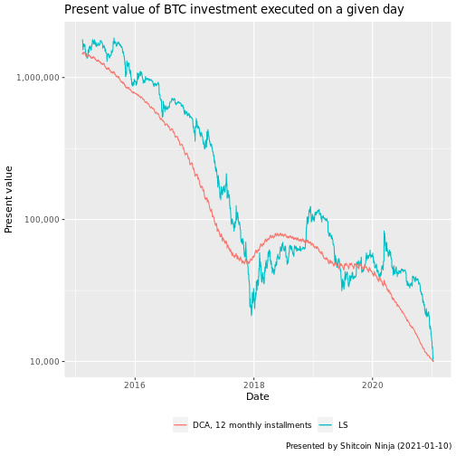
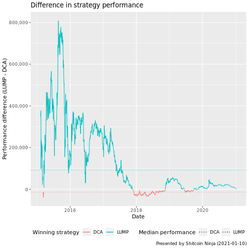

# Introduction

We are revisiting the Dollar Cost Averaging (**DCA**) vs Lump Sum (**LS**) article, quick and fast with fresh and (less boring) format :)


```r
# How much are we going to invest?
investment_value <- 10000

#what is the value of one dca chunk?
dca_n <- 12
dca_by <- 'month'
dca_chunk <- round(investment_value/dca_n, 2)
```

This time, we are investing $10000 in 2 ways:

* Either as a Lump Sum (**LS**) on a given day
* or as dollar-cost averaged (**DCA**) investment in 12 installments every month. (Each installment represents $833.33)

In order to keep it fair, money not invested yet with **DCA** is considered to be part of the returns. (You still have some installments to make, so you still have the money at present day sitting at 0% valuation) 

# Loading the data
For BTCUSD pair, we take prices at daily close value on Bitfinex (easily available at http://www.cryptodatadownload.com/data/bitfinex/ ). If you need, you can easily supplement your own.


```r
# Read close prices for the day
data <- read_csv('http://www.cryptodatadownload.com/cdd/Bitfinex_BTCUSD_d.csv', skip = 1) %>% 
  select(DATE = date, PRICE = close) %>% 
  arrange(DATE)
```

Our dataset contains


```r
# What is the price and date 'today' ?
price_start <- data %>% head(1) %>% pull(PRICE)
date_start <- data %>% head(1) %>% pull(DATE)
price_now <- data %>% tail(1) %>% pull(PRICE)
date_now <- data %>% tail(1) %>% pull(DATE)
```

BTC prices from 2015-02-09 up to 2021-01-10 . With these, we can calculate values of our **LS** and **DCA** investments, started at any given day.

# Calculating present value of investment

Now, let's calculate present value of an investment made on any given day in past


```r
# today's value of our lump sum investment executed on a given day
d1 <- data %>% 
  mutate(LUMP = round((!!investment_value)/PRICE*(!!price_now))) %>%
  # helper - we also calculate today's value of a DCA installment executed on this day
  # this way we do not have to recount it multiple times later
  mutate(DCA_CHUNK_VALUE = (!!dca_chunk)/PRICE*(!!price_now))

# calcualte leftover value for DCA investments executed late
d1$DCA_LEFTOVER <- vapply(
  #for each date
  d1$DATE,
  function(d) {
    # see on which days the DCA installements are made
    dates <- seq(d, length.out = dca_n, by = dca_by)
    
    # calculate how many are we missing for a given date
    missing_installements <- length(dates[dates > date_now])
    
    # return the leftover
    missing_installements * dca_chunk
  },
  0.01 #return double
)

# today's value of DCA investment, with execution started on a given day 
d1$DCA_12M <- vapply(
  # for each date
  data$DATE, 
  function(d) {
    #calculate the sum of
      sum(
        #price on 12 months following the date
        d1[d1$DATE %in% seq(d, length.out = dca_n, by = dca_by), ] %>% 
          pull(DCA_CHUNK_VALUE)
        ) #sum
    },
  0.01 #return double
)

# summarise DCA earnings
d1$DCA <- round(d1$DCA_12M + d1$DCA_LEFTOVER)

# compare winning strategy
d1$WIN <- case_when(d1$LUMP>d1$DCA ~ 'LUMP', T ~ 'DCA')
```

# Results

## Overall performance

Performance of both strategies can be visualised as follows


```r
d1 %>% 
  ggplot(aes(x = DATE)) +
  geom_line(aes(y = LUMP, color = 'LS')) +
  geom_line(aes(y = DCA, color = 'DCA, 12 monthly installments')) +
  scale_y_log10(labels = scales::comma) +
  labs(
    title = 'Present value of BTC investment executed on a given day',
    y = 'Present value',
    x = 'Date',
    color = '',
    caption = sprintf('Presented by Shitcoin Ninja (%s)', date_now)
  ) +
  theme(legend.position = 'bottom')
```



Aside from the fact, that we did not lose money no matter what strategy or time to invest have we chosen (up to this day(tm)), we can draw several conclusions:


```r
res1 <- d1 %>% 
  group_by(WIN) %>% 
  tally() %>% 
  pivot_wider(names_from = WIN, values_from = n)

dca_wins <- res1 %>% pull(DCA)
lump_wins <- res1 %>% pull(LUMP)

total_days <- dca_wins + lump_wins
dca_wins_p <- round(dca_wins/total_days * 100, 2)
lump_wins_p <- round(lump_wins/total_days * 100, 2)
```

From 2015-02-09 to 2021-01-10 (2163 days), investing via **LS** would win 1665 times (76.98%) while investing via **DCA** would win 498 times (23.02)


```r
dca_win_by <- d1 %>% filter(WIN == 'DCA') %>% mutate(DCA_WIN_BY = DCA - LUMP) %>% pull(DCA_WIN_BY)
lump_win_by <- d1 %>% filter(WIN == 'LUMP') %>% mutate(LUMP_WIN_BY = LUMP - DCA) %>% pull(LUMP_WIN_BY)

dca_mean_win_by <- round(mean(dca_win_by))
lump_mean_win_by <- round(mean(lump_win_by))

dca_median_win_by <- round(median(dca_win_by))
lump_median_win_by <- round(median(lump_win_by))
```

We can also look at how good or bad these strategies perform on the days they are winning

* On the days **DCA** wins, it wins over **LS** by $16212 on average (or $13998 in median value)
* On the days **LS** wins, it wins over **DCA** by $165052 on average (or $91952 in median value)

So, not only does **DCA** win only in 23.02% of cases, its performance is on average, 10.18 times **worse** even when it wins, and its median value is 6.57 times **worse**

## Difference in performance illustrated


```r
group_transitions = function(x) c(0,cumsum(x[-1L] != x[-length(x)]))+1

d1 %>% mutate(DIFF = LUMP-DCA, SIGN = DIFF < 0) %>% 
  ggplot(aes(x = DATE)) +
  geom_line(aes(y = DIFF, color = WIN, group=group_transitions(SIGN))) +
  geom_hline(aes(yintercept = -dca_median_win_by, color = 'DCA', linetype = 'DCA')) +
  geom_hline(aes(yintercept = lump_median_win_by, color = 'LUMP', linetype = 'LUMP')) +
  scale_linetype_manual(name = "Median performance", values = c(3, 3)) +
  scale_y_continuous(labels = scales::comma) +
  labs(
    title = 'Difference in strategy performance',
    y = 'Performance difference (LUMP - DCA)',
    x = 'Date',
    color = 'Winning strategy',
    caption = sprintf('Presented by Shitcoin Ninja (%s)', date_now),
    linetype = 'asdf'
  ) +
  theme(legend.position = 'bottom')
```




# Conclusion

If you decide to invest in BTC, Lump Sum yields statistically superior results. Past performance shows, that Lump Sum wins in 76.98% of cases, and when it wins, it performs 10.18 times better.

Source code for this is also available on [github](https://github.com/PPFilip/btc-Revisited). Feel free to copy, change and improve it.


